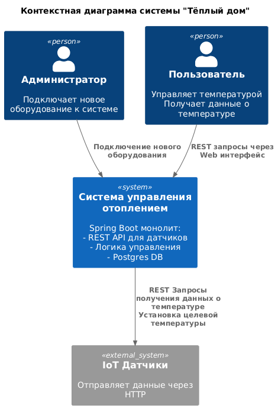
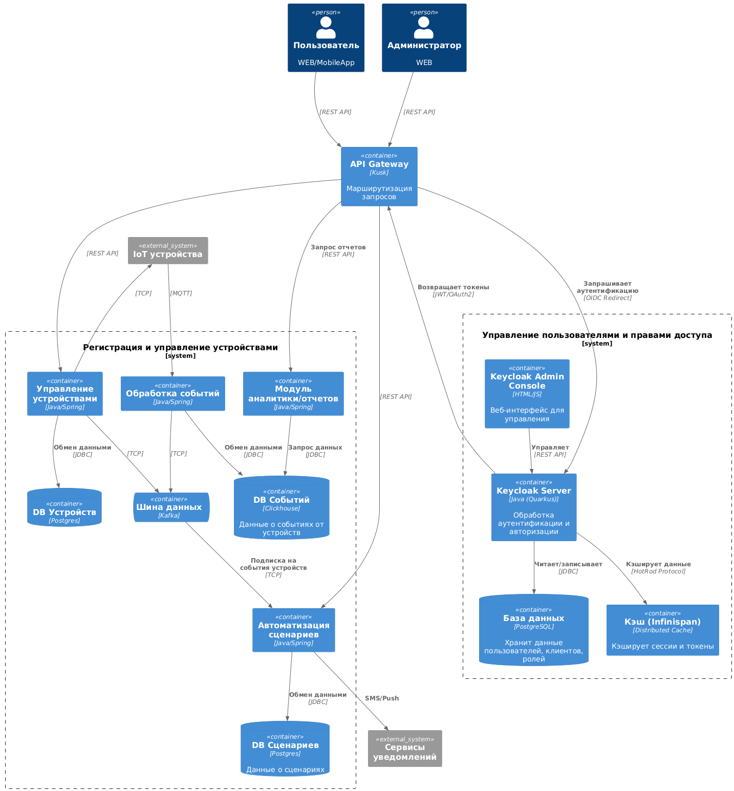

# Задание 1. Анализ и планирование

<aside>
«Тёплый дом» — это SaaS-решение для управления умным домом, изначально разработанное для удалённого контроля отопления. В текущем состоянии система представляет собой монолитное Java-приложение с PostgreSQL, позволяющее пользователям регулировать температуру в доме через веб-интерфейс. Подключение устройств требует выезда специалиста, а функционал ограничен синхронным взаимодействием с датчиками.
</aside>

### 1. Описание функциональности монолитного приложения

**Управление отоплением:**

 - Пользователи могут включать и выключать отопление через Web интерфейс.
 - Пользователи могут устанавливать температуру системы отопления через Web интерфейс.

**Мониторинг температуры:**

- Пользователи могут просматривать температуру в помещении через Web интерфейс.
- В Web интерфейс доступна информация о статусе системы (включено/выключено).

### 2. Анализ архитектуры монолитного приложения

**Стек:**
- Язык программирования: Java
- Фреймворк: SpingBoot
- База данных: PostgreSQL
- Система сборки: Maven
  
**Архитектура:**
- Монолитное приложение, все компоненты системы (обработка запросов, бизнес-логика, работа с данными) находятся в рамках одного приложения.
- Взаимодействие: Синхронное, запросы обрабатываются последовательно.
- Развёртывание: Требует остановки всего приложения.
  
**Текущие показатели**
- Кол-во клиентов: 100 веб-клиентов
- Кол-во датчиков: подключены 100 модулей управления отоплением

### 3. Определение доменов и границы контекстов

Домен Управление устройствами и автоматизация

Субдомены:
   Регистрация и управление устройствами
    Границы контекста: 
        - Подключение устройств (партнёрские/внутренние).
        - Валидация и хранение метаданных (тип, статус, параметры).
        - Поддержка самообслуживания (QR-коды, токены).
    Сценарии автоматизации
    Границы контекста: 
        - Создание правил.
        - Обработка событий от устройств (через Message Broker).
        - Интеграция с сервисами устройств (отопление, свет и т.д.).
Домен Управление пользователями и правами доступа
Граница контекста: Ведение реестра пользователя, прав доступа к системе, аутентификация и авторизация.
	
### **4. Проблемы монолитного решения**

- Нет возможности масштабирования компонентов системы при увеличении кол-ва клиентов.
- Разработку сложно распараллелить. Нет возможности выделить отдельные команды для работы над отдельными модулями
- Обновления системы связано с перезапуском монолита и риска отказа всей системы
- У клиентов отсутвует возможность самостоятельно подключать новые устройства
- Нет логики для работы с новыми типами устройств

### 5. Визуализация контекста системы — диаграмма С4

[С4 Context diagram](diagrams/context/asis.puml)

# Задание 2. Проектирование микросервисной архитектуры

**Диаграмма контейнеров (Containers)**

[С4 Container diagram](diagrams/container/ContainerC4.puml)

**Диаграмма компонентов (Components)**

[С4 Component diagram](diagrams/container/DeviceComponent.puml)

**Диаграмма кода (Code)**

[С4 Code diagram](diagrams/container/DeviceClasses.puml)

Добавьте одну диаграмму или несколько.

# Задание 3. Разработка ER-диаграммы

[С4 Code diagram](diagrams/container/er.puml)

# ❌ Задание 4. Создание и документирование API

### 1. Тип API

Укажите, какой тип API вы будете использовать для взаимодействия микросервисов. Объясните своё решение.

### 2. Документация API

Здесь приложите ссылки на документацию API для микросервисов, которые вы спроектировали в первой части проектной работы. Для документирования используйте Swagger/OpenAPI или AsyncAPI.
